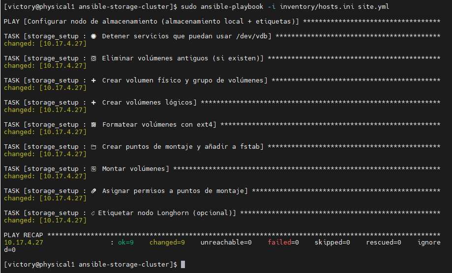

# 📦 Ansible Storage Cluster – FlatcarMicroCloud

Este proyecto automatiza la configuración de un nodo de almacenamiento (`storage1`) usando **Ansible**, optimizado para **Flatcar Linux** (sin Python) y clústeres Kubernetes con **K3s**. Forma parte del ecosistema [FlatcarMicroCloud](https://github.com/vhgalvez/FlatcarMicroCloud).

---

## ✨ Visión General

El nodo `storage1` ofrece almacenamiento persistente y distribuido para:

- Bases de datos como **PostgreSQL**
- Datos compartidos entre pods (**RWX**)
- Volúmenes gestionados por **Longhorn (RWO)**

Todo basado en volúmenes LVM y exportado mediante NFS, alojado en `/dev/vdb`.

---

## ⚙️ Requisitos

- Nodo o VM con **Flatcar Linux** (sin Python)
- Disco adicional de **80 GB** (`/dev/vdb`)
- Ansible >= 2.14 en el nodo controlador
- Acceso por clave SSH (ver `inventory/hosts.ini`)

---

## 📁 Directorios y Montaje en `storage1`

| Ruta                    | Tamaño | Propósito                                | Acceso  |
|-------------------------|--------|------------------------------------------|---------|
| `/srv/nfs/postgresql`   | 10 GB  | Almacenamiento de PostgreSQL vía NFS     | RW      |
| `/srv/nfs/shared`       | 10 GB  | Datos compartidos RWX entre pods         | RWX     |
| `/mnt/longhorn-disk`    | 60 GB  | Datos de respaldo Longhorn (solo lectura del pod) | RWO     |

---

## 📂 Estructura del Proyecto

```bash
ansible-storage-cluster/
├── inventory/
│   └── hosts.ini               # Nodo storage1
├── roles/
│   └── storage_setup/
│       └── tasks/
│           └── main.yml        # Configuración LVM, montaje y fstab
├── site.yml                    # Playbook principal (configura el nodo)
├── nfs_config.yml              # Exporta rutas NFS
├── playbook_cleanup.yml        # Limpia completamente el almacenamiento
├── LICENSE
└── README.md
```

---

## 🚀 Ejecución

### 1️⃣ Opcional: Limpiar configuración anterior

```bash
sudo ansible-playbook -i inventory/hosts.ini playbook_cleanup.yml
```

### 2️⃣ Configurar almacenamiento (`/dev/vdb`)

```bash
sudo ansible-playbook -i inventory/hosts.ini site.yml
```

Esto:

- Crea volúmenes LVM (`postgresql_lv`, `shared_lv`, `longhorn_lv`)
- Formatea los volúmenes en `ext4`
- Monta y configura en `fstab`

### 3️⃣ Exportar rutas NFS

```bash
ansible-playbook -i inventory/hosts.ini nfs_config.yml
```

Esto configura `/etc/exports` y activa `nfs-server`.

---

## 📌 Resultado Esperado

| Punto de Montaje         | Tamaño | Uso                                     |
|--------------------------|--------|------------------------------------------|
| `/srv/nfs/postgresql`    | 10 GB  | PostgreSQL vía NFS                       |
| `/srv/nfs/shared`        | 10 GB  | Datos compartidos RWX en pods            |
| `/mnt/longhorn-disk`     | 60 GB  | Backup/almacenamiento Longhorn           |

---

## 🧪 Verificación

### Comprobar volúmenes montados

```bash
df -h
```

### Ver exportaciones NFS

```bash
sudo exportfs -v
```

Deberías ver:

```bash
/srv/nfs/postgresql  *(rw,sync,no_subtree_check,no_root_squash)
/srv/nfs/shared      *(rw,sync,no_subtree_check,no_root_squash)
```

### Verificar servicio NFS

```bash
systemctl status nfs-server
```

### Probar montaje desde otro nodo

```bash
sudo mount -t nfs storage1.cefaslocalserver.com:/srv/nfs/postgresql /mnt
```

---

## 🧱 Tabla de Almacenamiento por Nodo

| Nodo         | Rol                     | IP           | Disco OS (GB) | Disco Adicional (GB) | Uso Disco Adicional                                             |
|--------------|--------------------------|--------------|---------------|-----------------------|------------------------------------------------------------------|
| `master1`    | Master Kubernetes        | 10.17.4.21   | 50            | —                     | —                                                                |
| `master2`    | Master Kubernetes        | 10.17.4.22   | 50            | —                     | —                                                                |
| `master3`    | Master Kubernetes        | 10.17.4.23   | 50            | —                     | —                                                                |
| `worker1`    | Worker + Longhorn        | 10.17.4.24   | 20            | 40                    | Almacenamiento Longhorn (RWO)                                   |
| `worker2`    | Worker + Longhorn        | 10.17.4.25   | 20            | 40                    | Almacenamiento Longhorn (RWO)                                   |
| `worker3`    | Worker + Longhorn        | 10.17.4.26   | 20            | 40                    | Almacenamiento Longhorn (RWO)                                   |
| `storage1`   | NFS + Longhorn Backup    | 10.17.4.27   | 10            | 80                    | `/srv/nfs/postgresql`, `/srv/nfs/shared`, `/mnt/longhorn-disk` |
| `postgresql1`| DB externa (futura)      | —            | —             | —                     | Montará `/srv/nfs/postgresql` vía NFS                           |
| `load_balancers` | HAProxy + Traefik   | 10.17.3.12-13| —             | —                     | No requiere almacenamiento persistente                          |
| `freeipa1`   | DNS / Auth               | 10.17.3.11   | —             | —                     | Disco interno mínimo para OS                                    |
| `pfSense`    | Firewall                 | 192.168.0.200| —             | —                     | No necesita discos adicionales                                  |

---

## 📌 Detalle del Nodo `storage1`

| Ruta Montada          | Tamaño | Propósito                                 | Tipo de Acceso |
|------------------------|--------|-------------------------------------------|----------------|
| `/srv/nfs/postgresql`  | 10 GB  | Volumen NFS para PostgreSQL               | RW             |
| `/srv/nfs/shared`      | 10 GB  | Datos compartidos entre pods              | RWX            |
| `/mnt/longhorn-disk`   | 60 GB  | Almacenamiento persistente para Longhorn  | RWO            |

> 🟡 **Recomendación:** marcar el nodo `storage1` como `NotSchedulable` para evitar que Kubernetes ejecute pods allí.

---

## 📸 Ansible OK



## ✍️ Autor

[**vhgalvez**](https://github.com/vhgalvez)

📦 Proyecto completo: [FlatcarMicroCloud](https://github.com/vhgalvez/FlatcarMicroCloud)

---

## 🛡️ Licencia

**MIT License** — Libre para uso educativo y personal.

